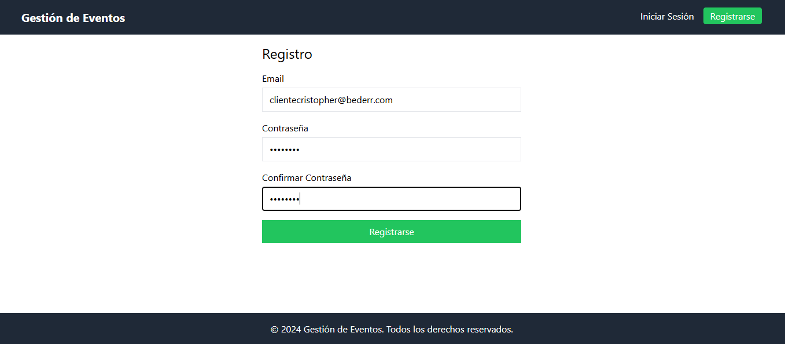
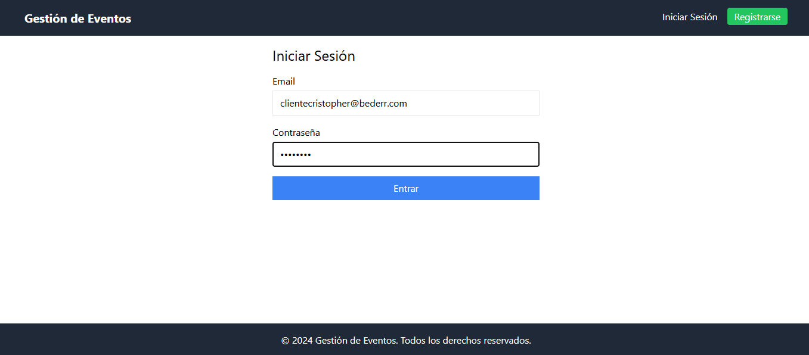

# Installation

## Installation Backend

1. Clone the repository.

```git
git clone git@github.com:vmarialuzm/reto-tecnico-bederr.git
```

2. CD to the backend folder

```bash
cd backend/
```

3. Configure a virtual environment

```bash
virtualenv venv
.\venv\Scripts\activate
```

4. Install the project dependecies

```bash
pip install -r requirements.txt
```

5. Create a .env file to configure the environment variables and copy the contents of the .env.example file and replace the values ​​with your credentials.

6. Run migrations

```bash
python manage.py migrate
```

7. Start the development server

```bash
python manage.py runserver
```

## Installation Frontend

1. CD to the frontend folder

```bash
cd frontend/
```

2. Install project dependencies

```bash
npm install
```

3. Run the development server

```bash
npm run dev
```

# Web app views

## Register


## Login


## Listado de los Eventos


## Detalle de un Evento


## Listar mis Inscripciones


# Documentation
https://documenter.getpostman.com/view/24887141/2sAYJ1mNea
